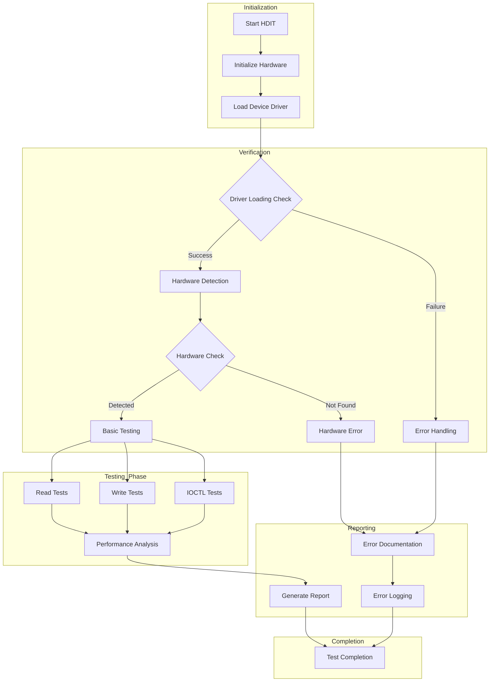
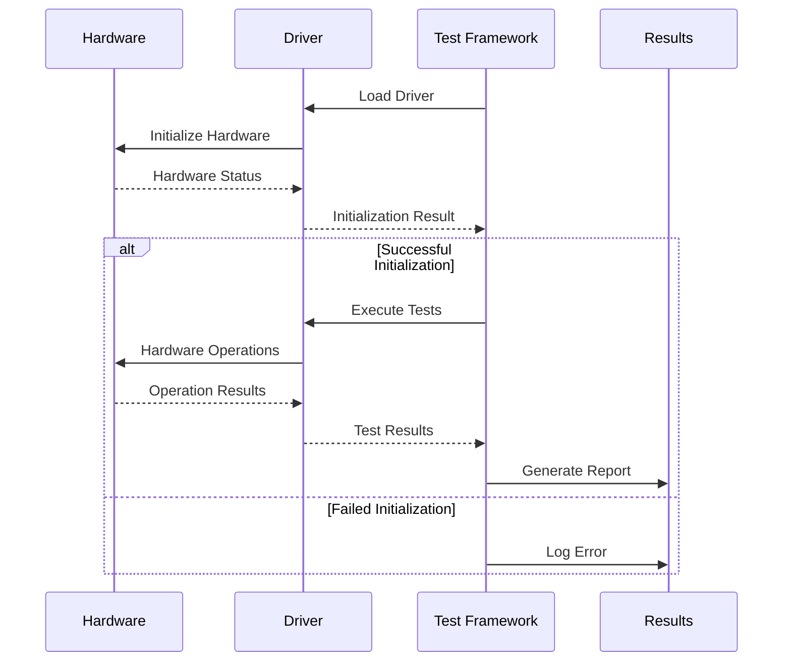

# Hardware Driver Interface Testing

## HDIT Architecture Framework
```python
class HardwareDriverTesting:
    """Framework for testing hardware with drivers directly"""
    
    def architecture(self):
        return {
            "components": {
                "hardware": "Physical device/component",
                "drivers": "Device drivers/firmware",
                "test_framework": "Testing software",
                "interfaces": "Communication protocols"
            }
        }
```
## HDIT Process Flow



## Common Application 
```python
    class DriverTesting:
    def test_scenarios(self):
        return {
            "initialization": {
                "driver_loading": "Test driver loading sequence",
                "hardware_detection": "Verify hardware recognition",
                "resource_allocation": "Check system resources"
            },
            "communication": {
                "data_transfer": "Test data read/write operations",
                "interrupt_handling": "Verify interrupt processing",
                "dma_operations": "Test DMA transfers"
            },
            "error_handling": {
                "timeout_scenarios": "Test response timeouts",
                "invalid_commands": "Handle invalid inputs",
                "recovery_procedures": "Test error recovery"
            }
        }
```
## Real World Example
```python
class HardwareExamples:
    def peripheral_testing(self):
        return {
            "usb_devices": {
                "operations": [
                    "Device enumeration",
                    "Bulk transfers",
                    "Isochronous transfers",
                    "Control transfers"
                ],
                "test_cases": [
                    "Hot-plug detection",
                    "Data throughput",
                    "Power management"
                ]
            },
            "network_cards": {
                "operations": [
                    "Packet transmission",
                    "Interrupt handling",
                    "Buffer management"
                ],
                "test_cases": [
                    "Maximum throughput",
                    "Error recovery",
                    "Multiple connections"
                ]
            },
            "storage_devices": {
                "operations": [
                    "Read/Write operations",
                    "Command queuing",
                    "Error correction"
                ],
                "test_cases": [
                    "Data integrity",
                    "Performance metrics",
                    "Recovery from power loss"
                ]
            }
        }
```


## HDIT Sequence Diagram


## Implementation Example
```python
    class HardwareDriverIntegrationTest:
    def __init__(self, device_path: str, driver_path: str):
        self.device_path = device_path
        self.driver_path = driver_path
        self.test_results = {}
        
    def test_driver_loading(self):
        """Test driver loading and initialization"""
        try:
            # Load driver
            self.load_driver()
            
            # Verify device presence
            if self.verify_device_presence():
                return {"status": "PASS", "message": "Driver loaded successfully"}
            else:
                return {"status": "FAIL", "message": "Device not detected"}
                
        except Exception as e:
            return {"status": "ERROR", "message": str(e)}
            
    def test_basic_operations(self):
        """Test basic hardware operations"""
        operations = {
            "read": self.test_read_operation(),
            "write": self.test_write_operation(),
            "ioctl": self.test_ioctl_commands()
        }
        return operations
        
    def test_performance(self):
        """Measure performance metrics"""
        metrics = {
            "response_time": self.measure_response_time(),
            "throughput": self.measure_throughput(),
            "resource_usage": self.check_resource_usage()
        }
        return metrics
```
## Practical Example: Testing a Custom USB
```python
    class USBDeviceTester:
    def __init__(self, vendor_id: str, product_id: str):
        self.vendor_id = vendor_id
        self.product_id = product_id
        self.device = None
        
    def setup_test(self):
        """Initialize device testing"""
        try:
            import usb.core
            import usb.util
            
            # Find device
            self.device = usb.core.find(
                idVendor=int(self.vendor_id, 16),
                idProduct=int(self.product_id, 16)
            )
            
            if self.device is None:
                raise ValueError('Device not found')
                
            # Set configuration
            self.device.set_configuration()
            return True
            
        except Exception as e:
            logging.error(f"Setup failed: {str(e)}")
            return False
            
    def test_communication(self):
        """Test basic communication"""
        try:
            # Send test data
            test_data = [0x01, 0x02, 0x03, 0x04]
            self.device.write(0x01, test_data)
            
            # Read response
            response = self.device.read(0x81, 64)
            
            return {
                "status": "SUCCESS",
                "sent": test_data,
                "received": list(response)
            }
            
        except Exception as e:
            return {
                "status": "FAILED",
                "error": str(e)
            }
            
    def test_endpoints(self):
        """Test all endpoints"""
        results = {}
        for endpoint in self.device[0][0]:
            try:
                if endpoint.bEndpointAddress & 0x80:
                    # IN endpoint
                    data = self.device.read(
                        endpoint.bEndpointAddress,
                        endpoint.wMaxPacketSize
                    )
                else:
                    # OUT endpoint
                    test_data = [0] * endpoint.wMaxPacketSize
                    written = self.device.write(
                        endpoint.bEndpointAddress,
                        test_data
                    )
                results[endpoint.bEndpointAddress] = "PASS"
            except Exception as e:
                results[endpoint.bEndpointAddress] = f"FAIL: {str(e)}"
        return results
```
## Error Handling and Recovery
```python
class ErrorHandling:
    def test_error_scenarios(self):
        return {
            "driver_errors": [
                "Invalid command handling",
                "Timeout recovery",
                "Resource conflict resolution"
            ],
            "hardware_errors": [
                "Communication loss recovery",
                "Power cycle handling",
                "Reset sequence verification"
            ],
            "system_errors": [
                "Resource exhaustion handling",
                "Interrupt conflicts",
                "DMA errors"
            ]
        }
```
## Performance Monitoring
```python
class PerformanceMonitor:
    def __init__(self):
        self.metrics = {}
        self.start_time = None
        
    def start_monitoring(self):
        self.start_time = time.time()
        self.metrics = {
            "response_times": [],
            "throughput": [],
            "error_count": 0,
            "resource_usage": {
                "cpu": [],
                "memory": [],
                "io": []
            }
        }
        
    def record_metric(self, metric_type: str, value: float):
        if metric_type in self.metrics:
            self.metrics[metric_type].append(value)
            
    def generate_report(self):
        return {
            "duration": time.time() - self.start_time,
            "average_response": statistics.mean(self.metrics["response_times"]),
            "max_throughput": max(self.metrics["throughput"]),
            "error_rate": self.metrics["error_count"] / len(self.metrics["response_times"])
        }
```
## Benefits of Direct Hardware-Driver Testing:

1. Real-world behavior verification
2. Actual timing characteristics
3. True hardware interactions
4. Complete system integration testing
5. Performance under real conditions
6. Resource utilization measurement
