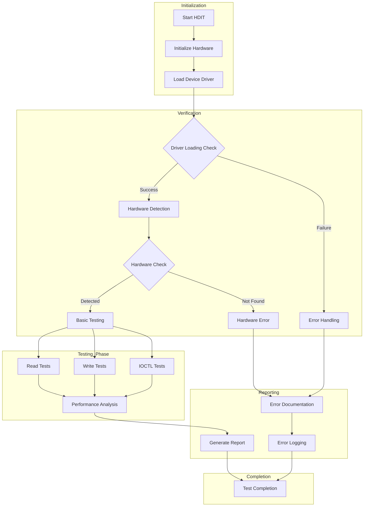
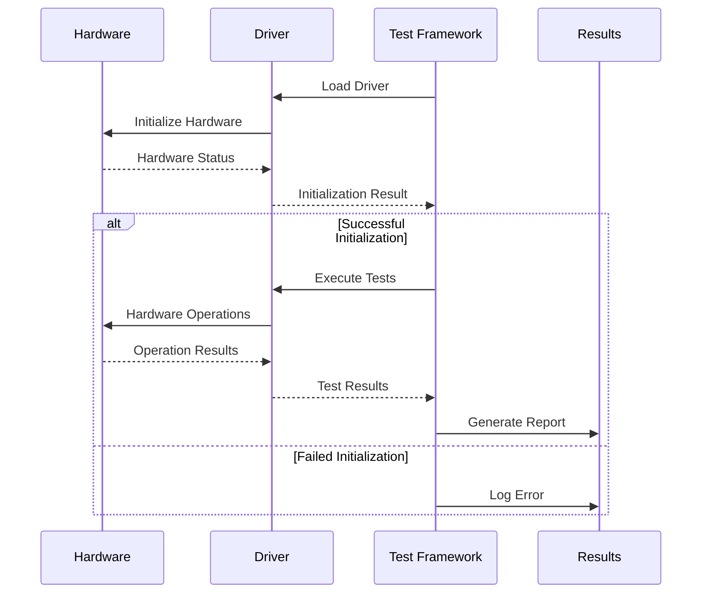

# HDITTesting

## HDIT Process Flow

```mermaid
flowchart TD
    subgraph Initialization
    A[Start HDIT] --> B[Initialize Hardware]
    B --> C[Load Device Driver]
    end
    
    subgraph Verification
    C --> D{Driver Loading Check}
    D -->|Success| E[Hardware Detection]
    D -->|Failure| M[Error Handling]
    
    E --> F{Hardware Check}
    F -->|Detected| G[Basic Testing]
    F -->|Not Found| N[Hardware Error]
    end
    
    subgraph Testing_Phase
    G --> H[Read Tests]
    G --> I[Write Tests]
    G --> J[IOCTL Tests]
    
    H --> K[Performance Analysis]
    I --> K
    J --> K
    end
    
    subgraph Reporting
    K --> L[Generate Report]
    M --> O[Error Documentation]
    N --> O
    O --> P[Error Logging]
    end
    
    subgraph Completion
    L --> Q[Test Completion]
    P --> Q
    end
```

## HDIT Sequence Diagram

```mermaid
    sequenceDiagram
    participant H as Hardware
    participant D as Driver
    participant T as Test Framework
    participant R as Results
    
    T->>D: Load Driver
    D->>H: Initialize Hardware
    H-->>D: Hardware Status
    D-->>T: Initialization Result
    
    alt Successful Initialization
        T->>D: Execute Tests
        D->>H: Hardware Operations
        H-->>D: Operation Results
        D-->>T: Test Results
        T->>R: Generate Report
    else Failed Initialization
        T->>R: Log Error
    end
```
