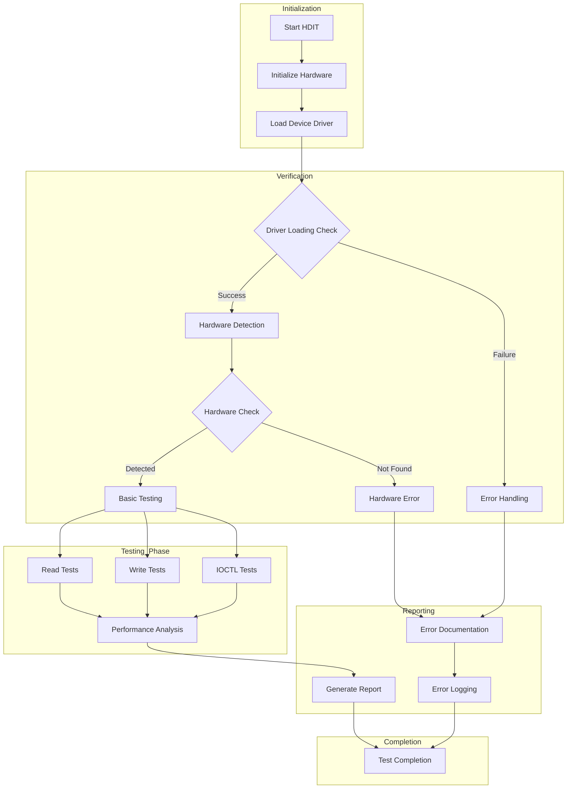
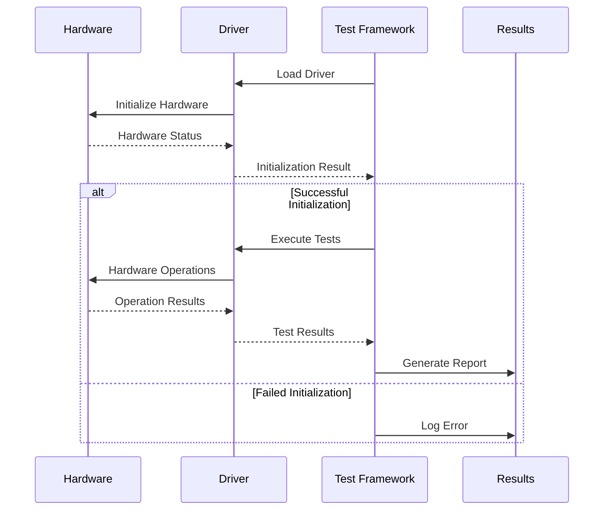

# HDITTesting

## HDIT Architecture Framework
```python
class HardwareDriverTesting:
    """Framework for testing hardware with drivers directly"""
    
    def architecture(self):
        return {
            "components": {
                "hardware": "Physical device/component",
                "drivers": "Device drivers/firmware",
                "test_framework": "Testing software",
                "interfaces": "Communication protocols"
            }
        }
```

## Common Application 
```python
    class DriverTesting:
    def test_scenarios(self):
        return {
            "initialization": {
                "driver_loading": "Test driver loading sequence",
                "hardware_detection": "Verify hardware recognition",
                "resource_allocation": "Check system resources"
            },
            "communication": {
                "data_transfer": "Test data read/write operations",
                "interrupt_handling": "Verify interrupt processing",
                "dma_operations": "Test DMA transfers"
            },
            "error_handling": {
                "timeout_scenarios": "Test response timeouts",
                "invalid_commands": "Handle invalid inputs",
                "recovery_procedures": "Test error recovery"
            }
        }
```
## Real World Example
```json
    class HardwareExamples:
    def peripheral_testing(self):
        return {
            "usb_devices": {
                "operations": [
                    "Device enumeration",
                    "Bulk transfers",
                    "Isochronous transfers",
                    "Control transfers"
                ],
                "test_cases": [
                    "Hot-plug detection",
                    "Data throughput",
                    "Power management"
                ]
            },
            "network_cards": {
                "operations": [
                    "Packet transmission",
                    "Interrupt handling",
                    "Buffer management"
                ],
                "test_cases": [
                    "Maximum throughput",
                    "Error recovery",
                    "Multiple connections"
                ]
            },
            "storage_devices": {
                "operations": [
                    "Read/Write operations",
                    "Command queuing",
                    "Error correction"
                ],
                "test_cases": [
                    "Data integrity",
                    "Performance metrics",
                    "Recovery from power loss"
                ]
            }
        }
```

## HDIT Process Flow



## HDIT Sequence Diagram


## Implementation Example
```python
    class HardwareDriverIntegrationTest:
    def __init__(self, device_path: str, driver_path: str):
        self.device_path = device_path
        self.driver_path = driver_path
        self.test_results = {}
        
    def test_driver_loading(self):
        """Test driver loading and initialization"""
        try:
            # Load driver
            self.load_driver()
            
            # Verify device presence
            if self.verify_device_presence():
                return {"status": "PASS", "message": "Driver loaded successfully"}
            else:
                return {"status": "FAIL", "message": "Device not detected"}
                
        except Exception as e:
            return {"status": "ERROR", "message": str(e)}
            
    def test_basic_operations(self):
        """Test basic hardware operations"""
        operations = {
            "read": self.test_read_operation(),
            "write": self.test_write_operation(),
            "ioctl": self.test_ioctl_commands()
        }
        return operations
        
    def test_performance(self):
        """Measure performance metrics"""
        metrics = {
            "response_time": self.measure_response_time(),
            "throughput": self.measure_throughput(),
            "resource_usage": self.check_resource_usage()
        }
        return metrics
```
